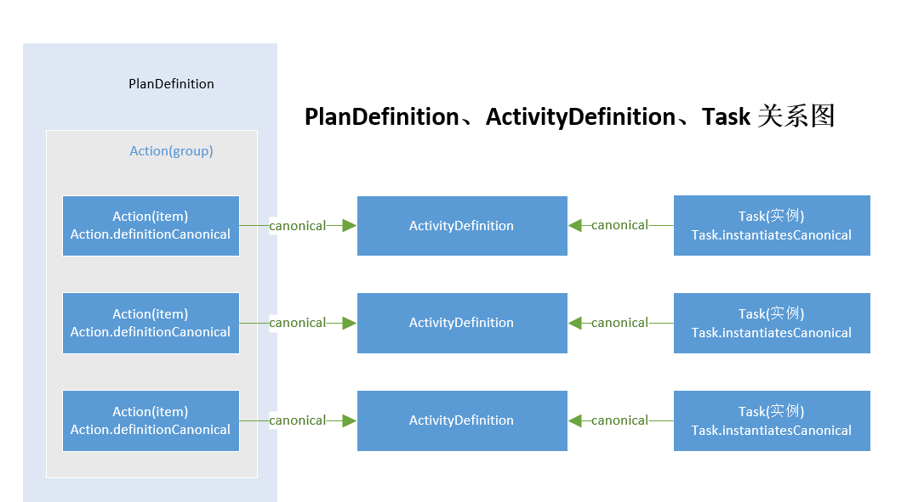

## 业务背景
<font size=3>
&emsp;&emsp;“双向转诊”，简而言之就是“小病进社区，大病进医院”，积极发挥大中型医院在人才、技术及设备等方面的优势，同时充分利用各社区医院的服务功能和网点资源，促使基本医疗逐步下沉社区，社区群众危重病、疑难病的救治到大中型医院。

## 场景简介
&emsp;&emsp;医生根据患者个人意愿并综合患者病情、转入医院学科特长和床位占用情况等信息发送转诊预约申请请求，经转入医院医生审核确认同意后反馈转出医院，告知患者，同步传送电子病历、检查检验结果信息和（或）电子健康档案信息，患者到诊后，回传患者到诊消息通知。主要业务过程包括床位信息查询、转诊预约申请提交、申请审核与确认、审核应答、履约情况确认、病历上传等。


## FHIR资源应用

> 在本场景中主要使用到以下资源：

### 业务资源  

- [HospitalReferral](https://build.fhir.org/ig/karldavids/CN-Public-Health-Core-R4/StructureDefinition-hospital-referral.html):双向转诊预约申请资源，该资源描述医院转诊的的申请。包括上转、下转都使用该资源。
- [HospitalReferralResponse](https://build.fhir.org/ig/karldavids/CN-Public-Health-Core-R4/StructureDefinition-hospital-referral-response.html)：双向转诊应答资源，该资源描述在提交转诊申请后，由接收方 给出是否同意的转诊应答。
- [MedicalRecordDocumentation](https://build.fhir.org/ig/HL7China/CN-CORE-R4/branches/develop/StructureDefinition-medical-record-documentation.html)：病历引用资源，引用第三方的病历文书，并且把病历文书作为附件形式上传。
- [HospitalBed](https://build.fhir.org/ig/HL7China/CN-CORE-R4/branches/develop/StructureDefinition-hospital-bed.html)：病床信息资源，描述医院床位的基础信息以及当前状态。
- [Patient](https://build.fhir.org/ig/HL7China/CN-CORE-R4/branches/develop/StructureDefinition-Patient.html)：患者资源，接受医疗健康服务的个人或动物，医疗过程是以患者为中心的。对交叉索进行中国本地化约定。
- [Practitioner](https://build.fhir.org/ig/HL7China/CN-CORE-R4/branches/develop/StructureDefinition-Practitioner.html)：医护人员资源，直接或间接参与提供医疗健康服务的人员。
- [Department](https://build.fhir.org/ig/HL7China/CN-CORE-R4/branches/develop/StructureDefinition-Department.html)：科室/部门资源，描述医院科室/部门的基础信息。
- [Hospital](https://build.fhir.org/ig/HL7China/CN-CORE-R4/branches/develop/StructureDefinition-Hospital.html)：医院资源，描述医疗机构（医院）的基本信息。
- [PractitionerRole](https://build.fhir.org/ig/HL7China/CN-CORE-R4/branches/develop/StructureDefinition-PractitionerRole.html)：医护人员工作信息资源，医务人员提供医疗服务时的岗位相关信息，包括所属组织、科室、角色/岗位等。
关系图如下：


### 工作流资源
- [ActivityDefinition](http://hl7.org/fhir/r4/activitydefinition.html)：活动定义资源，定义在医务流程中每一个活动，描述期在流程中的作用。
- [PlanDefinition](http://hl7.org/fhir/r4/plandefinition.html)：活动计划资源，通过活动计划资源可以对活动定义资源进行组装，并且实现活动流程的定义，以及活动之前的先后关系，触发条件等信息，该资源可描述一个完整的业务流程。
- [Task](http://hl7.org/fhir/r4/task.html)：任务资源，作为[ActivityDefinition](http://hl7.org/fhir/r4/activitydefinition.html)的实例，每次开启流程后，每一个步骤都对应一个[Task](http://hl7.org/fhir/r4/task.html)资源，作为流程步骤的附加产物，并且关联该任务执行中 产出的业务资源。

关系图如下：


## 对接方式

双向转诊-住院 业务流程主要包括两类：
- 转入医院和转出医院都具备自己的系统，并且和双向转诊平台做数据接入，实现功能。
- 转入医院不需要和双向转诊信息平台做系统对接，所有业务在双向转诊信息平台上直接操作。
  
### 通过双转平台对接


转诊路程：

1.	转出医院根据获取到的转入医院的科室床位资源情况，发起转诊预约申请，附带基本病情介绍，转诊预约申请经过发送到 双转平台。
2.	双转平台根据实际情况进行审批。
3.	审批通过后，通过双转平台下发申请审核应答到转出医院。
4.	患者到转入医院报到后，办理入院手续，双转平台回传患者到诊通知到转出医院。
5.	根据到诊通知，转出医院上传该患者相关的病历资料到双转平台。

### 通过双转平台操作


转诊流程：

1.	转出医院根据获取到的转入医院的科室床位资源情况，发起转诊预约申请，附带基本病情介绍，转诊预约申请经过双转平台发送到 转入医院。
2.	转入医院医生根据实际情况进行审批。
3.	审批通过后，通过双转平台下发申请审核应答到转出医院。
4.	患者到转入医院报到后，办理入院手续，回传患者到诊通知到转出医院。
5.	根据到诊通知，转出医院上传该患者相关的病历资料到双转平台，并且转发到转入医院。


## 数据传输方式

本场景中，使用[Bundle](http://hl7.org/fhir/r4/bundle.html) 资源作为 消息传输的载体，组装流程和业务数据，通过通信协议进行交互，数据传输结构如下：

# 数据传输结构


[Bundle](http://hl7.org/fhir/r4/bundle.html)作为数据载体，[Bundle](http://hl7.org/fhir/r4/bundle.html)资源下的[Bundle.type](http://hl7.org/fhir/r4/bundle-definitions.html#Bundle.type)节点在该场景下可选择两种方式：
- message：使用消息发送的方式传输数据，第一个资源必须为第一个资源是[MessageHeader](http://hl7.org/fhir/r4/messageheader.html)。[Bundle.type](http://hl7.org/fhir/r4/bundle-definitions.html#Bundle.type)节点为 message。
- transaction/transaction-response：使用事物请求/应答方式传输数据，该方式是一个事务-所有资源由服务器作为原子资源提交进行处理。[Bundle.type](http://hl7.org/fhir/r4/bundle-definitions.html#Bundle.type)节点为 transaction/transaction-response。
  
# 数据传输示例（message）

> 转诊申请 

```xml
<?xml version="1.0" encoding="utf-8" ?>
<Bundle xmlns="http://hl7.org/fhir">
	<id value="1234567890"/>
	<type value="message"/>
	<!--************************消息头****************************-->
	<entry>
		<resource>
			<MessageHeader xmlns="http://hl7.org/fhir">
				<!--1.1 消息ID（实例ID，重发不变）-->
				<id value="A00000000001"/>
				<!--消息事件 1..1-->
				<eventCoding>
						<!-- 0..1 事件类型 CodeSystem url  -->
						<system value="http://CodeSystem.hl7fhir.cn/activity-code"/>
						<!-- 0..1 事件类型代码-->
						<code value="C01001"/>
						<!-- 0..1 事件类型名称 -->
						<display value="转诊预约申请"/>
				</eventCoding>
				<!-- 1..1 消息源应用程序 -->
				<source>
					<!-- 0..1 系统名称（发送消息的系统） -->
					<name value="[string]"/>
					<!-- 0..1 软件名称（子系统名称） -->
					<software value="[string]"/>
					<!-- 0..1 运行的软件版本（当前版本） -->
					<version value="[string]"/>
					<!-- 1..1 ID地址(当前操作客户端IP地址) -->
					<endpoint value="[uri]"/>
				</source>
				<!--消息实际内容 0..*-->
				<focus>
					<!-- 0..1 Reference(Task) 关联任务信息（Task） -->
					<reference value="Task/Task-application-for-referral-appointment"/>
				</focus>
			</MessageHeader>
		</resource>
	</entry>
	<!--************************转诊申请任务（Task）******************************-->
	<entry>
		<resource>
			<Task xmlns="http://hl7.org/fhir">
				<id value="Task-application-for-referral-appointment"/>
				<!-- 0..1 canonical(ActivityDefinition) 关联ActivityDefinition -->
				<instantiatesCanonical>
					<reference value="http://ActivityDefinition.hl7fhir.cn/application-for-referral-appointment"/>
				</instantiatesCanonical>
				<!-- 1..1 状态 draft | requested | received | accepted | + -->
				<status value="requested"/>

				<!-- 1..1 目的 unknown | proposal | plan | order | original-order |reflex-order | filler-order | instance-order | option -->
				<intent value="proposal"/>
				<!-- 0..1 CodeableConcept 事件类型 -->
				<businessStatus>
					<coding>
						<!-- 0..1 事件类型 CodeSystem url  -->
						<system value="http://CodeSystem.hl7fhir.cn/activity-code"/>
						<!-- 0..1 事件类型代码-->
						<code value="C01001"/>
						<!-- 0..1 事件类型名称 -->
						<display value="转诊预约申请"/>
					</coding>
				</businessStatus>
				<!-- 0..1 CodeableConcept Task Type 任务类型-->
				<code>
					<coding>
						<!-- 0..1 任务类型 CodeSystem url  -->
						<system value="http://hl7.org/fhir/CodeSystem/task-code"/>
						<!-- 0..1 任务类型代码-->
						<code value="approve"/>
						<!-- 0..1 任务类型名称 -->
						<display value="Activate/approve the focal resource"/>
					</coding>
				</code>
				<!-- 0..1 任务描述 -->
				<description value="提交转诊预约申请"/>
				<!-- 0..1 Reference(Any) 关联该任务正在处理的资源 -->
				<focus>
					<reference value="Appointment/A00000001"/>
				</focus>
				<!-- ?? 0..1 任务创建日期 -->
				<authoredOn value="2019-02-10T13:00:00Z"/>
				<!-- ?? 0..1 最后更新日期 -->
				<lastModified value="2019-02-10T13:00:00Z"/>
				<!-- 0..1 任务创建者，关联医护人员 -->
				<requester>
					<reference value="Practitioner/1234"/>
				</requester>
				<!-- 0..* 任务备注 -->
				<note>
					<!-- 1..1 The annotation  - text content (as markdown) -->
					<text value="[markdown]"/>
				</note>
			</Task>
		</resource>
	</entry>
	<!--************************转诊申请******************************-->
	<entry>
		<resource>
			<Appointment xmlns="http://hl7.org/fhir">
				<!-- 0..1 住院转诊预约逻辑ID -->
				<id value="A00000001"/>
				<meta>
					<profile value="http://StructureDefinition.hl7fhir.cn/hospital-referral"/>
				</meta>
				<!-- 0..* 转诊编号 -->
				<identifier>
					<!-- 0..1 转诊编号NamingSystem uri-->
					<system value="http://NamingSystem.hl7fhir.cn/hospital-referral-identifier"/>
					<!-- 0..1 转诊编号 -->
					<value value="A000000123345"/>
				</identifier>
				<!-- 1..1 预约状态 -->
				<status value="booked">
					<extension url="http://StructureDefinition.hl7fhir.cn/resource-status">
						<valueCoding>
							<!-- 0..1 预约状态 CodeSystem url -->
							<system value=" http://hl7.org/fhir/appointmentstatus"/>
							<!-- 0..1 预约状态代码-->
							<code value="proposed"/>
							<!-- 0..1 预约状态说明 -->
							<display value="proposed"/>
						</valueCoding>
					</extension>
				</status>
				<!-- 0..1 服务类别 -->
				<serviceCategory>
					<coding>
						<!-- 0..1 服务类别 CodeSystem url  -->
						<system value="http://CodeSystem.hl7fhir.cn/service-category"/>
						<!-- 0..1 服务类别代码-->
						<code value="01"/>
						<!-- 0..1 服务类别名称 -->
						<display value="医疗服务"/>
					</coding>
				</serviceCategory>
				<!-- 0..1 服务项目分类 -->
				<serviceType>
					<coding>
						<!-- 0..1 服务项目分类 CodeSystem url  -->
						<system value="http://CodeSystem.hl7fhir.cn/service-type"/>
						<!-- 0..1 服务项目分类代码-->
						<code value="03"/>
						<!-- 0..1 服务项目分类 -->
						<display value="转诊预约"/>
					</coding>
				</serviceType>
				<!-- 0..1 预约期间开始时间 -->
				<start value="2019-02-12T13:00:00Z"/>
				<!-- 0..1  预约期间结束时间 -->
				<end value="2019-02-20T13:00:00Z"/>
				<!-- 0..* Reference(Any) 该次预约的相关信息（转诊病历） -->
				<supportingInformation>
					<reference value="DocumentReference/ABCD00001"/>
				</supportingInformation>
				<!-- 0..1 预约申请时间 -->
				<created value="2019-02-10T13:00:00Z"/>
				<!-- 0..1 注意事项 -->
				<patientInstruction value="转诊手续完成，请患者到接收医院报到。"/>
				<!-- 1..1 医生 -->
				<participant>
					<!-- 0..1 参与者角色 -->
					<type>
						<coding>
							<!-- 0..1 参与者角色 CodeSystem url  -->
							<system value="http://CodeSystem.hl7fhir.cn/encounter-participant-type"/>
							<!-- 0..1 参与者角色代码-->
							<code value="01"/>
							<!-- 0..1 参与者角色 -->
							<display value="责任医生"/>
						</coding>
					</type>
					<!-- 0..1  Reference(Practitioner）关联医护人员信息 -->
					<actor>
						<reference value="Practitioner/1234"/>
					</actor>
					<!-- 1..1  状态 固定为 needs-action（需要回应）    accepted | declined | tentative | needs-action -->
					<status value="needs-action"/>
				</participant>
				<!-- 1..1 患者 -->
				<participant>
					<!-- 0..1 参与者角色 -->
					<type>
						<coding>
							<!-- 0..1 参与者角色 CodeSystem url  -->
							<system value="http://CodeSystem.hl7fhir.cn/encounter-participant-type"/>
							<!-- 0..1 参与者角色代码-->
							<code value="06"/>
							<!-- 0..1 参与者角色 -->
							<display value="患者"/>
						</coding>
					</type>
					<!-- 0..1  Reference(Patient）关联患者信息 -->
					<actor>
						<reference value="Patient/12345"/>
					</actor>
					<!-- 1..1  状态 固定为accepted（确定）    accepted | declined | tentative |needs-action -->
					<status value="accepted"/>
				</participant>
			</Appointment>
		</resource>
	</entry>
	<!--************************患者信息******************************-->
	<entry>
		<resource>
			<Patient xmlns="http://hl7.org/fhir">
				<!--0..1 患者ID-->
				<id value="12345"/>
				<meta>
					<profile value="http://StructureDefinition.hl7fhir.cn/Patient"/>
				</meta>
				<!--1..* 身份证件号 -->
				<identifier>
					<!--证件类型-->
					<type>
						<coding>
							<!-- 证件类型CodeSystem  地址 -->
							<system value="http://CodeSystem.hl7fhir.cn/identity-document-type"/>
							<!-- 0..1 证件类别编码 -->
							<code value="[code]"/>
							<!-- 0..1 证件类别名称 -->
							<display value="[string]"/>
						</coding>
					</type>
					<!--0..1 身份证件号码NamingSystem uri-->
					<system value="http://NamingSystem.hl7fhir.cn/identityDocument"/>
					<!-- 0..1 身份证件号码 -->
					<value value="[string]"/>
				</identifier>
				<!-- 0..* 患者姓名 -->
				<name>
					<!-- 0..1 全名 -->
					<text value="张三"/>
				</name>
				<!-- 0..1 生理性别 -->
				<gender>
					<extension url="http://StructureDefinition.hl7fhir.cn/sexual-distinction-of-human">
						<valueCoding>
							<!-- 0..1 生理性别 CodeSystem url  地址-->
							<system value="http://CodeSystem.hl7fhir.cn/physiological-gender"/>
							<!-- 0..1 生理性别代码-->
							<code value="01"/>
							<!-- 0..1 生理性别说明 -->
							<display value="男"/>
						</valueCoding>
					</extension>
				</gender>
				<!--  0..* 联系电话 -->
				<telecom>
					<!--  0..1 类型 phone | fax | email | pager | url | sms | other -->
					<system value="phone"/>
					<!-- 0..1 电话号码 -->
					<value value="13387362763"/>
				</telecom>
				<!-- 0..1 出生日期 -->
				<birthDate value="1980-02-01"/>
				<!--0..1 地址-->
				<address>
					<!-- 0..1 地址的完整描述 -->
					<text value="[string]"/>
					<!--行政区划代码(由于行政区划为12位村) -->
					<extension url="http://StructureDefinition.hl7fhir.cn/AdministrativeDivision">
						<!--行政区划代码 -->
						<valueStrng value="5101002029378110"/>
					</extension>
				</address>

				<!--联系人 -->
				<contact>
					<relationship>
						<coding>
							<system value="http://CodeSystem.hl7fhir.cn/contact-relationship" />
							<!-- 联系人关系代码 -->
							<code value="father" />
							<!-- 联系人关系名称 -->
							<display value="父亲"/>
						</coding>
					</relationship>
					<!-- 联系人姓名 -->
					<name>
						<text value="联系人" />
					</name>
				</contact>
				<!-- 0..1 婚姻状况 GB/T 2261.2-->
				<maritalStatus>
					<coding>
						<!-- 婚姻状况CodeSystem  地址 -->
						<system value="http://CodeSystem.hl7fhir.cn/marital-status"/>
						<!-- 0..1 婚姻状况编码 -->
						<code value="[code]"/>
						<!-- 0..1 婚姻状况 -->
						<display value="[string]"/>
					</coding>
				</maritalStatus>
				<!-- 民族 -->
				<extension url="http://StructureDefinition.hl7fhir.cn/ChineseEthnicity">
					<valueCoding>
						<system value="http://CodeSystem.hl7fhir.cn/nationalites-of-PRC"/>
						<!-- 民族编码 -->
						<code value="1"/>
						<!-- 民族名称 -->
						<display value="汉族"/>
					</valueCoding>
				</extension>				
			</Patient>
		</resource>
	</entry>
	<!--************************转诊病历******************************-->
	<entry>
		<resource>
			<DocumentReference xmlns="http://hl7.org/fhir">
				<!--0..1 病历文档ID-->
				<id value="ABCD00001"/>

				<meta>
					<profile value="http://StructureDefinition.hl7fhir.cn/medical-record-documentation"/>
				</meta>
				<!-- 0..1 病历文档标识符 -->
				<masterIdentifier>
					<!-- 0..1 病历文档标识符NamingSystem uri-->
					<system value="http://NamingSystem.hl7fhir.cn/document-Identifier"/>
					<!-- 0..1 病历文档标识符 -->
					<value value="1234567890"/>
				</masterIdentifier>
				<!-- 1..1 文档引用状态  current | superseded | entered-in-error -->
				<status >
					<extension url="http://StructureDefinition.hl7fhir.cn/resource-status">
						<valueCoding>
							<!-- 0..1 文档引用状态 CodeSystem url -->
							<system value="http://hl7.org/fhir/document-reference-status"/>
							<!-- 0..1 文档引用状态代码-->
							<code value="current"/>
							<!-- 0..1 文档引用状态说明 -->
							<display value="Current"/>
						</valueCoding>
					</extension>
				</status>
				<!-- 0..1 文档类型 （固定为 城乡居民健康档案基本数据集）-->
				<type>
					<coding>
						<!-- 文档类型CodeSystem  地址 -->
						<system value="http://CodeSystem.hl7fhir.cn/document-type"/>
						<!-- 0..1 文档类型编码 -->
						<code value="WS365-2011"/>
						<!-- 0..1 文档类型名称 -->
						<display value="城乡居民健康档案基本数据集"/>
					</coding>
				</type>
				<!-- 0..* 文档类别(固定为  转诊（院）记录) -->
				<category>
					<coding>
						<!-- 文档类别CodeSystem  地址 -->
						<system value="http://CodeSystem.hl7fhir.cn/document-category"/>
						<!-- 0..1 文档类别编码 -->
						<code value="HSDC00.05"/>
						<!-- 0..1 文档类别名称 -->
						<display value="转诊（院）记录"/>
					</coding>
				</category>
				<!-- 0..1 患者 -->
				<subject>
					<reference value="Patient/12345"/>
				</subject>
				<!-- 0..1 文档编写日期 -->
				<date value="2019-02-20T13:00:00Z"/>
				<!-- 0..* Reference(Practitioner|PractitionerRole|Organization|Device|Patient|RelatedPerson) 文档编写者 -->
				<author>
					<reference value="Practitioner/1234"/>
				</author>
				<!-- 0..1 文档审核者 -->
				<authenticator>
					<reference value="Practitioner/1234"/>
				</authenticator>
				<!-- 0..1 Reference(Organization) 管理机构（管理文档的医疗机构） -->
				<custodian>
					<reference value="Organization/123345"/>
				</custodian>
				<!-- 0..1 文档描述 -->
				<description value="城乡居民健康档案基本数据集-转诊（院）记录"/>
				<!-- 0..* 安全级别 -->
				<securityLabel>
					<coding>
						<!-- 安全级别CodeSystem  地址 -->
						<system value="http://CodeSystem.hl7fhir.cn/security-labels"/>
						<!-- 0..1 安全级别编码 -->
						<code value="N"/>
						<!-- 0..1 安全级别名称 -->
						<display value="中级"/>
					</coding>
				</securityLabel>
				<!-- 1..* 文档正文 -->
				<content>
					<!-- 1..1 附件 -->
					<attachment>
						<!-- 0..1 文档的Mime type -->
						<contentType value="HTML"/>
						<!-- 0..1 Human language of the content (BCP-47) （zh-CN）-->
						<language value="zh-CN"/>
						<!-- 0..1 文档URL -->
						<url value="http://document.com/1234567"/>
						<!-- 0..1 文件大小 -->
						<size value="24"/>
						<!-- 0..1 文档标题 -->
						<title value="转诊（院）记录"/>
						<!-- 0..1 创建该附件日期 -->
						<creation value="2019-02-20T13:00:00Z"/>
					</attachment>
				</content>
			</DocumentReference>
		</resource>
	</entry>
</Bundle>
```


> 转诊应答
  
```xml 
<?xml version="1.0" encoding="utf-8" ?>
<Bundle xmlns="http://hl7.org/fhir">
	<id value="1234567890"/>
	<type value="message"/>
	<!--************************消息头****************************-->
	<entry>
		<resource>
			<MessageHeader xmlns="http://hl7.org/fhir">
				<!--1.1 消息ID（实例ID，重发不变）-->
				<id value="A00000000001"/>
				<!--消息事件 1..1-->
				<eventCoding>
					<!-- 0..1 事件类型 CodeSystem url  -->
					<system value="http://CodeSystem.hl7fhir.cn/activity-code"/>
					<!-- 0..1 事件类型代码-->
					<code value="C01002"/>
					<!-- 0..1 事件类型名称 -->
					<display value="转诊预约申请应答"/>
				</eventCoding>
				<!-- 1..1 消息源应用程序 -->
				<source>
					<!-- 0..1 系统名称（发送消息的系统） -->
					<name value="[string]"/>
					<!-- 0..1 软件名称（子系统名称） -->
					<software value="[string]"/>
					<!-- 0..1 运行的软件版本（当前版本） -->
					<version value="[string]"/>
					<!-- 1..1 ID地址(当前操作客户端IP地址) -->
					<endpoint value="[uri]"/>
				</source>
				<!--消息实际内容 0..*-->
				<focus>
					<!-- 0..1 Reference(Task) 关联任务信息（Task） -->
					<reference value="Task/Task-application-for-referral-appointment-response"/>
				</focus>
			</MessageHeader>
		</resource>
	</entry>
	<!--************************转诊申请应答任务（Task）******************************-->
	<entry>
		<resource>
			<Task xmlns="http://hl7.org/fhir">
				<id value="Task-application-for-referral-appointment-response"/>
				<!-- 0..1 canonical(ActivityDefinition) 关联ActivityDefinition -->
				<instantiatesCanonical>
					<reference value="http://ActivityDefinition.hl7fhir.cn/application-for-referral-appointment-response"/>
				</instantiatesCanonical>
				<!-- 1..1 状态 draft | requested | received | accepted | + -->
				<status value="requested"/>
				<!-- 1..1 目的 unknown | proposal | plan | order | original-order | reflex-order | filler-order | instance-order| option -->
				<intent value="proposal"/>
				<!-- 0..1 CodeableConcept 事件类型 -->
				<businessStatus>
					<coding>
						<!-- 0..1 事件类型 CodeSystem url  -->
						<system value="http://CodeSystem.hl7fhir.cn/activity-code"/>
						<!-- 0..1 事件类型代码-->
						<code value="C01002"/>
						<!-- 0..1 事件类型名称 -->
						<display value="转诊预约申请应答"/>
					</coding>
				</businessStatus>
				<!-- 0..1 CodeableConcept Task Type 任务类型-->
				<code>
					<coding>
						<!-- 0..1 任务类型 CodeSystem url  -->
						<system value="http://hl7.org/fhir/CodeSystem/task-code"/>
						<!-- 0..1 任务类型代码-->
						<code value="approve"/>
						<!-- 0..1 任务类型名称 -->
						<display value="Activate/approve the focal resource"/>
					</coding>
				</code>
				<!-- 0..1 任务描述 -->
				<description value="转诊预约申请应答"/>
				<!-- 0..1 Reference(Any) 关联该任务正在处理的资源 -->
				<focus>
					<reference value="AppointmentResponse/B0000001"/>
				</focus>
				<!-- ?? 0..1 任务创建日期 -->
				<authoredOn value="2019-02-10T13:00:00Z"/>
				<!-- ?? 0..1 最后更新日期 -->
				<lastModified value="2019-02-10T13:00:00Z"/>
				<!-- 0..1 任务创建者，关联医护人员 -->
				<requester>
					<reference value="Practitioner/1234"/>
				</requester>
				<!-- 0..* 任务备注 -->
				<note>
					<!-- 1..1 The annotation  - text content (as markdown) -->
					<text value="[markdown]"/>
				</note>
			</Task>
		</resource>
	</entry>		
	<!--************************转诊应答******************************-->
	<entry>
		<resource>
			<AppointmentResponse xmlns="http://hl7.org/fhir">
				<!-- 0..1 住院转诊预约应答逻辑ID -->
				<id value="B0000001"/>
				<meta>
					<profile value="http://StructureDefinition.hl7fhir.cn/hospital-referral-response"/>
				</meta>

				<!-- 0..* 同意转诊编号 -->
				<identifier>
					<!-- 0..1 同意转诊编号NamingSystem uri-->
					<system value="http://NamingSystem.hl7fhir.cn/hospital-referral-response-identifier"/>
					<!-- 0..1 同意转诊编号 -->
					<value value="YBAU00003"/>
				</identifier>


				<!-- 1..1 Reference(Appointment) 申请编号 -->
				<appointment>
					<reference value="Appointment/A00000001"/>
				</appointment>

				<!-- 0..1 允许转诊的开始时间 -->
				<start value="[instant]"/>
				<!-- 0..1 允许转诊的结束时间 -->
				<end value="[instant]"/>
				<!-- 0..* 参与者角色（该处为固定为医护人员） -->
				<participantType>
					<coding>
						<!-- 0..1 参与者角色 CodeSystem url  -->
						<system value="http://CodeSystem.hl7fhir.cn/encounter-participant-type"/>
						<!-- 0..1 参与者角色代码-->
						<code value="01"/>
						<!-- 0..1 参与者角色 -->
						<display value="住院医生"/>
					</coding>
				</participantType>
				<!-- 0..1 同意转诊医生编码 -->
				<actor>
					<reference value="Practitioner/PractitionerID"/>
				</actor>
				<!-- 1..1 转诊确定状态 默认为（同意接收转诊） accepted   accepted | declined | tentative | needs-action -->
				<participantStatus value="accepted"/>
				<!-- 0..1 备注 -->
				<comment value="同意转诊，患者尽快到诊，已保留床位。"/>
			</AppointmentResponse>
		</resource>
	</entry>	
</Bundle>
```

> 患者到诊


```xml 
<?xml version="1.0" encoding="utf-8" ?>
<Bundle xmlns="http://hl7.org/fhir">
	<id value="1234567890"/>
	<type value="message"/>
	<!--************************消息头****************************-->
	<entry>
		<resource>
			<MessageHeader xmlns="http://hl7.org/fhir">
				<!--1.1 消息ID（实例ID，重发不变）-->
				<id value="A00000000004"/>
				<!--消息事件 1..1-->
				<eventCoding>
					<!-- 0..1 事件类型 CodeSystem url  -->
					<system value="http://CodeSystem.hl7fhir.cn/activity-code"/>
					<!-- 0..1 事件类型代码-->
					<code value="C01003"/>
					<!-- 0..1 事件类型名称 -->
					<display value="患者到诊"/>
				</eventCoding>
				<!-- 1..1 消息源应用程序 -->
				<source>
					<!-- 0..1 系统名称（发送消息的系统） -->
					<name value="[string]"/>
					<!-- 0..1 软件名称（子系统名称） -->
					<software value="[string]"/>
					<!-- 0..1 运行的软件版本（当前版本） -->
					<version value="[string]"/>
					<!-- 1..1 ID地址(当前操作客户端IP地址) -->
					<endpoint value="[uri]"/>
				</source>
				<!--消息实际内容 0..*-->
				<focus>
					<!-- 0..1 Reference(Task) 关联任务信息（Task） -->
					<reference value="Task/Task-patient-arrive-response"/>
				</focus>
			</MessageHeader>
		</resource>
	</entry>
	<!--************************患者到诊任务（Task）******************************-->
	<entry>
		<resource>
			<Task xmlns="http://hl7.org/fhir">
			<id value="Task-patient-arrive-response"/>
			<!-- 0..1 canonical(ActivityDefinition) 关联ActivityDefinition -->
			<instantiatesCanonical>
				<reference value="http://ActivityDefinition.hl7fhir.cn/patient-arrive-response"/>
			</instantiatesCanonical>
			<!-- 1..1 状态 draft | requested | received | accepted | + -->
			<status value="requested"/>
			<!-- 1..1 目的 unknown | proposal | plan | order | original-order | reflex-order | filler-order | instance-order | option -->
			<intent value="proposal"/>
			<!-- 0..1 CodeableConcept 事件类型 -->
			<businessStatus>
				<coding>
					<!-- 0..1 事件类型 CodeSystem url  -->
					<system value="http://CodeSystem.hl7fhir.cn/activity-code"/>
					<!-- 0..1 事件类型代码-->
					<code value="C01003"/>
					<!-- 0..1 事件类型名称 -->
					<display value="患者到诊"/>
				</coding>
			</businessStatus>
				<!-- 0..1 CodeableConcept Task Type 任务类型-->
				<code>
					<coding>
						<!-- 0..1 任务类型 CodeSystem url  -->
						<system value="http://hl7.org/fhir/CodeSystem/task-code"/>
						<!-- 0..1 任务类型代码-->
						<code value="approve"/>
						<!-- 0..1 任务类型名称 -->
						<display value="Activate/approve the focal resource"/>
					</coding>
				</code>
				<!-- 0..1 任务描述 -->
				<description value="患者到诊，回传患者到诊信息。"/>
				<!-- 0..1 Reference(Any) 关联该任务正在处理的资源 -->
				<focus>
					<reference value="AppointmentResponse/B0000001"/>
				</focus>
				<!-- ?? 0..1 任务创建日期 -->
				<authoredOn value="2019-02-10T13:00:00Z"/>
				<!-- ?? 0..1 最后更新日期 -->
				<lastModified value="2019-02-10T13:00:00Z"/>
				<!-- 0..1 任务创建者，关联医护人员 -->
				<requester>
					<reference value="Practitioner/1234"/>
				</requester>
				<!-- 0..* 任务备注 -->
				<note>
					<!-- 1..1 The annotation  - text content (as markdown) -->
					<text value="[markdown]"/>
				</note>
			</Task>
		</resource>
	</entry>
	<!--************************患者到诊******************************-->
	<entry>
		<resource>
			<AppointmentResponse xmlns="http://hl7.org/fhir">
				<!-- 0..1 住院转诊预约应答逻辑ID -->
				<id value="B0000001"/>
				<meta>
					<profile value="http://StructureDefinition.hl7fhir.cn/hospital-referral-response"/>
				</meta>
				<!-- 0..* 同意转诊编号 -->
				<identifier>
					<!-- 0..1 同意转诊编号NamingSystem uri-->
					<system value="http://NamingSystem.hl7fhir.cn/hospital-referral-response-identifier"/>
					<!-- 0..1 同意转诊编号 -->
					<value value="YBAU00003"/>
				</identifier>
				<!-- 1..1 Reference(Appointment) 申请编号 -->
				<appointment>
					<reference value="Appointment/A00000001"/>
				</appointment>
				<!-- 0..1 允许转诊的开始时间 -->
				<start value="2019-02-10T13:00:00Z"/>
				<!-- 0..1 允许转诊的结束时间 -->
				<end value="2019-02-10T13:00:00Z"/>
				<!-- 0..* 参与者角色（该处为固定为医护人员） -->
				<participantType>
					<coding>
						<!-- 0..1 参与者角色 CodeSystem url  -->
						<system value="http://CodeSystem.hl7fhir.cn/encounter-participant-type"/>
						<!-- 0..1 参与者角色代码-->
						<code value="01"/>
						<!-- 0..1 参与者角色 -->
						<display value="患者"/>
					</coding>
				</participantType>
				<!-- 0..1 患者编码 -->
				<actor>
					<reference value="Patient /12345"/>
				</actor>
				<!-- 1..1 转诊确定状态 默认为（同意接收转诊） accepted   accepted | declined | tentative | needs-action -->
				<participantStatus value="accepted"/>
				<!-- 0..1 备注 -->
				<comment value="患者已经到诊。"/>
			</AppointmentResponse>
		</resource>
	</entry>
</Bundle>
```

> 病历提交

```xml
<?xml version="1.0" encoding="utf-8" ?> 
<Bundle xmlns="http://hl7.org/fhir">
	<id value="1234567890"/>
	<type value="message"/>
	<!--************************消息头****************************-->
	<entry>
		<resource>
			<MessageHeader xmlns="http://hl7.org/fhir">
				<!--1.1 消息ID（实例ID，重发不变）-->
				<id value="A00000000005"/>
				<!--消息事件 1..1-->
				<eventCoding>
					<!-- 0..1 事件类型 CodeSystem url  -->
					<system value="http://CodeSystem.hl7fhir.cn/activity-code"/>
					<!-- 0..1 事件类型代码-->
					<code value="C01004"/>
					<!-- 0..1 事件类型名称 -->
					<display value="转诊完整病历上传"/>
				</eventCoding>
				<!-- 1..1 消息源应用程序 -->
				<source>
					<!-- 0..1 系统名称（发送消息的系统） -->
					<name value="[string]"/>
					<!-- 0..1 软件名称（子系统名称） -->
					<software value="[string]"/>
					<!-- 0..1 运行的软件版本（当前版本） -->
					<version value="[string]"/>
					<!-- 1..1 ID地址(当前操作客户端IP地址) -->
					<endpoint value="[uri]"/>
				</source>
				<!--消息实际内容 0..*-->
				<focus>
					<!-- 0..1 Reference(Task) 关联任务信息（Task） -->
					<reference value="Task/Task-medical-records-submitted"/>
				</focus>
			</MessageHeader>
		</resource>
	</entry>
	<!--************************患者到诊任务（Task）******************************-->
	<entry>
		<resource>
			<Task xmlns="http://hl7.org/fhir">
				<id value="Task-medical-records-submitted"/>
				<!-- 0..1 canonical(ActivityDefinition) 关联ActivityDefinition -->
				<instantiatesCanonical>
					<reference value="http://ActivityDefinition.hl7fhir.cn/medical-records-submitted"/>
				</instantiatesCanonical>
				<!-- 1..1 状态 draft | requested | received | accepted | + -->
				<status value="requested"/>
				<!-- 1..1 目的 unknown | proposal | plan | order | original-order | reflex-order | filler-order | instance-order | option -->
				<intent value="proposal"/>
				<!-- 0..1 CodeableConcept 事件类型 -->
				<businessStatus>
					<coding>
						<!-- 0..1 事件类型 CodeSystem url  -->
						<system value="http://CodeSystem.hl7fhir.cn/activity-code"/>
						<!-- 0..1 事件类型代码-->
						<code value="C01004"/>
						<!-- 0..1 事件类型名称 -->
						<display value="转诊完整病历上传"/>
					</coding>
				</businessStatus>
				<!-- 0..1 CodeableConcept Task Type 任务类型-->
				<code>
					<coding>
						<!-- 0..1 任务类型 CodeSystem url  -->
						<system value="http://hl7.org/fhir/CodeSystem/task-code"/>
						<!-- 0..1 任务类型代码-->
						<code value="approve"/>
						<!-- 0..1 任务类型名称 -->
						<display value="Activate/approve the focal resource"/>
					</coding>
				</code>
				<!-- 0..1 任务描述 -->
				<description value="患者到转入医院办理手续入院后，转出医院上传病历信息。"/>
				<!-- 0..1 Reference(Any) 关联该任务正在处理的资源 -->
				<focus>
					<reference value="Bundle/BL000001"/>
				</focus>
				<!-- ?? 0..1 任务创建日期 -->
				<authoredOn value="2019-02-10T13:00:00Z"/>
				<!-- ?? 0..1 最后更新日期 -->
				<lastModified value="2019-02-10T13:00:00Z"/>
				<!-- 0..1 任务创建者，关联医护人员 -->
				<requester>
					<reference value="Practitioner/1234"/>
				</requester>
				<!-- 0..* 任务备注 -->
				<note>
					<!-- 1..1 The annotation  - text content (as markdown) -->
					<text value="[markdown]"/>
				</note>
			</Task>
		</resource>
	</entry>
	<!--************************病历集合******************************-->
	<entry>
		<resource>
			<Bundle xmlns="http://hl7.org/fhir">
				<id value="BL000001"/>
				<type value="batch"/>			
				<!--************************病历1******************************-->
				<entry>
					<resource>
						<reference value="Bundle/BLA000001"/>
					</resource>
				</entry>
				<!--************************病历2******************************-->
				<entry>
					<resource>
						<reference value="Bundle/BLA000002"/>
					</resource>
				</entry>
				<!--************************病历3******************************-->
				<entry>
					<resource>
						<reference value="Bundle/BLA000003"/>
					</resource>
				</entry>
			</Bundle>
		</resource>
	</entry>
	<!--************************病历1******************************-->
	<entry>
		<resource>
			<DocumentReference xmlns="http://hl7.org/fhir">
				<!--0..1 病历文档ID-->
				<id value="BLA000001"/>
				<meta>
					<profile value="http://StructureDefinition.hl7fhir.cn/medical-record-documentation"/>
				</meta>
				<!-- 0..1 病历文档标识符 -->
				<masterIdentifier>
					<!-- 0..1 病历文档标识符NamingSystem uri-->
					<system value="http://NamingSystem.hl7fhir.cn/document-Identifier"/>
					<!-- 0..1 病历文档标识符 -->
					<value value="BLA000001"/>
				</masterIdentifier>
				<!-- 1..1 文档引用状态  current | superseded | entered-in-error -->
				<status >
					<extension url="http://StructureDefinition.hl7fhir.cn/resource-status">
						<valueCoding>
							<!-- 0..1 文档引用状态 CodeSystem url -->
							<system value="http://hl7.org/fhir/document-reference-status"/>
							<!-- 0..1 文档引用状态代码-->
							<code value="current"/>
							<!-- 0..1 文档引用状态说明 -->
							<display value="Current"/>
						</valueCoding>
					</extension>
				</status>
				<!-- 0..1 文档类型 （固定为 城乡居民健康档案基本数据集）-->
				<type>
					<coding>
						<!-- 文档类型CodeSystem  地址 -->
						<system value="http://CodeSystem.hl7fhir.cn/document-type"/>
						<!-- 0..1 文档类型编码 -->
						<code value="WS365-2011"/>
						<!-- 0..1 文档类型名称 -->
						<display value="城乡居民健康档案基本数据集"/>
					</coding>
				</type>
				<!-- 0..* 文档类别(固定为  转诊（院）记录) -->
				<category>
					<coding>
						<!-- 文档类别CodeSystem  地址 -->
						<system value="http://CodeSystem.hl7fhir.cn/document-category"/>
						<!-- 0..1 文档类别编码 -->
						<code value="HSDC00.XX"/>
						<!-- 0..1 文档类别名称 -->
						<display value="病历1"/>
					</coding>
				</category>
				<!-- 0..1 患者 -->
				<subject>
					<reference value="Patient/12345"/>
				</subject>
				<!-- 0..1 文档编写日期 -->
				<date value="2019-02-20T13:00:00Z"/>
				<!-- 0..* Reference(Practitioner|PractitionerRole|Organization|Device|Patient|RelatedPerson) 文档编写者 -->
				<author>
					<reference value="Practitioner/1123456"/>
				</author>
				<!-- 0..1 文档审核者 -->
				<authenticator>
					<reference value="Practitioner/1123456"/>
				</authenticator>
				<!-- 0..1 Reference(Organization) 管理机构（管理文档的医疗机构） -->
				<custodian>
					<reference value="Organization/2345677"/>
				</custodian>
				<!-- 0..1 文档描述 -->
				<description value="城乡居民健康档案基本数据集-病历1"/>
				<!-- 0..* 安全级别 -->
				<securityLabel>
					<coding>
						<!-- 安全级别CodeSystem  地址 -->
						<system value="http://CodeSystem.hl7fhir.cn/security-labels"/>
						<!-- 0..1 安全级别编码 -->
						<code value="N"/>
						<!-- 0..1 安全级别名称 -->
						<display value="中级"/>
					</coding>
				</securityLabel>
				<!-- 1..* 文档正文 -->
				<content>
					<!-- 1..1 附件 -->
					<attachment>
						<!-- 0..1 文档的Mime type -->
						<contentType value="HTML"/>
						<!-- 0..1 Human language of the content (BCP-47) （zh-CN）-->
						<language value="zh-CN"/>
						<!-- 0..1 文档URL -->
						<url value="http://document.com/C00000000001"/>
						<!-- 0..1 文件大小 -->
						<size value="24"/>
						<!-- 0..1 文档标题 -->
						<title value="病历1"/>
						<!-- 0..1 创建该附件日期 -->
						<creation value="2019-02-20T13:00:00Z"/>
					</attachment>
				</content>
			</DocumentReference>
		</resource>
	</entry>
	<!--************************病历2******************************-->
	<entry>
		<resource>
			<DocumentReference xmlns="http://hl7.org/fhir">
				<!--0..1 病历文档ID-->
				<id value="BLA000002"/>
				<meta>
					<profile value="http://StructureDefinition.hl7fhir.cn/medical-record-documentation"/>
				</meta>
				<!-- 0..1 病历文档标识符 -->
				<masterIdentifier>
					<!-- 0..1 病历文档标识符NamingSystem uri-->
					<system value="http://NamingSystem.hl7fhir.cn/document-Identifier"/>
					<!-- 0..1 病历文档标识符 -->
					<value value="BLA000002"/>
				</masterIdentifier>
				<!-- 1..1 文档引用状态  current | superseded | entered-in-error -->
				<status >
					<extension url="http://StructureDefinition.hl7fhir.cn/resource-status">
						<valueCoding>
							<!-- 0..1 文档引用状态 CodeSystem url -->
							<system value="http://hl7.org/fhir/document-reference-status"/>
							<!-- 0..1 文档引用状态代码-->
							<code value="current"/>
							<!-- 0..1 文档引用状态说明 -->
							<display value="Current"/>
						</valueCoding>
					</extension>
				</status>
				<!-- 0..1 文档类型 （固定为 城乡居民健康档案基本数据集）-->
				<type>
					<coding>
						<!-- 文档类型CodeSystem  地址 -->
						<system value="http://CodeSystem.hl7fhir.cn/document-type"/>
						<!-- 0..1 文档类型编码 -->
						<code value="WS365-2011"/>
						<!-- 0..1 文档类型名称 -->
						<display value="城乡居民健康档案基本数据集"/>
					</coding>
				</type>
				<!-- 0..* 文档类别(固定为  转诊（院）记录) -->
				<category>
					<coding>
						<!-- 文档类别CodeSystem  地址 -->
						<system value="http://CodeSystem.hl7fhir.cn/document-category"/>
						<!-- 0..1 文档类别编码 -->
						<code value="HSDC00.XX"/>
						<!-- 0..1 文档类别名称 -->
						<display value="病历2"/>
					</coding>
				</category>
				<!-- 0..1 患者 -->
				<subject>
					<reference value="Patient/12345"/>
				</subject>
				<!-- 0..1 文档编写日期 -->
				<date value="2019-02-20T13:00:00Z"/>
				<!-- 0..* Reference(Practitioner|PractitionerRole|Organization|Device|Patient|RelatedPerson) 文档编写者 -->
				<author>
					<reference value="Practitioner/1123456"/>
				</author>
				<!-- 0..1 文档审核者 -->
				<authenticator>
					<reference value="Practitioner/1123456"/>
				</authenticator>
				<!-- 0..1 Reference(Organization) 管理机构（管理文档的医疗机构） -->
				<custodian>
					<reference value="Organization/2345677"/>
				</custodian>
				<!-- 0..1 文档描述 -->
				<description value="城乡居民健康档案基本数据集-病历2"/>
				<!-- 0..* 安全级别 -->
				<securityLabel>
					<coding>
						<!-- 安全级别CodeSystem  地址 -->
						<system value="http://CodeSystem.hl7fhir.cn/security-labels"/>
						<!-- 0..1 安全级别编码 -->
						<code value="N"/>
						<!-- 0..1 安全级别名称 -->
						<display value="中级"/>
					</coding>
				</securityLabel>

				<!-- 1..* 文档正文 -->
				<content>
					<!-- 1..1 附件 -->
					<attachment>
						<!-- 0..1 文档的Mime type -->
						<contentType value="HTML"/>
						<!-- 0..1 Human language of the content (BCP-47) （zh-CN）-->
						<language value="zh-CN"/>
						<!-- 0..1 文档URL -->
						<url value="http://document.com/C00000000002"/>
						<!-- 0..1 文件大小 -->
						<size value="24"/>
						<!-- 0..1 文档标题 -->
						<title value="病历2"/>
						<!-- 0..1 创建该附件日期 -->
						<creation value="2019-02-20T13:00:00Z"/>
					</attachment>
				</content>
			</DocumentReference>
		</resource>
	</entry>
	<!--************************病历3******************************-->
	<entry>
		<resource>
			<DocumentReference xmlns="http://hl7.org/fhir">
				<!--0..1 病历文档ID-->
				<id value="BLA000003"/>

				<meta>
					<profile value="http://StructureDefinition.hl7fhir.cn/medical-record-documentation"/>
				</meta>

				<!-- 0..1 病历文档标识符 -->
				<masterIdentifier>
					<!-- 0..1 病历文档标识符NamingSystem uri-->
					<system value="http://NamingSystem.hl7fhir.cn/document-Identifier"/>
					<!-- 0..1 病历文档标识符 -->
					<value value="BLA000003"/>
				</masterIdentifier>
				<!-- 1..1 文档引用状态  current | superseded | entered-in-error -->
				<status >
					<extension url="http://StructureDefinition.hl7fhir.cn/resource-status">
						<valueCoding>
							<!-- 0..1 文档引用状态 CodeSystem url -->
							<system value="http://hl7.org/fhir/document-reference-status"/>
							<!-- 0..1 文档引用状态代码-->
							<code value="current"/>
							<!-- 0..1 文档引用状态说明 -->
							<display value="Current"/>
						</valueCoding>
					</extension>
				</status>
				<!-- 0..1 文档类型 （固定为 城乡居民健康档案基本数据集）-->
				<type>
					<coding>
						<!-- 文档类型CodeSystem  地址 -->
						<system value="http://CodeSystem.hl7fhir.cn/document-type"/>
						<!-- 0..1 文档类型编码 -->
						<code value="WS365-2011"/>
						<!-- 0..1 文档类型名称 -->
						<display value="城乡居民健康档案基本数据集"/>
					</coding>
				</type>
				<!-- 0..* 文档类别(固定为  转诊（院）记录) -->
				<category>
					<coding>
						<!-- 文档类别CodeSystem  地址 -->
						<system value="http://CodeSystem.hl7fhir.cn/document-category"/>
						<!-- 0..1 文档类别编码 -->
						<code value="HSDC00.XX"/>
						<!-- 0..1 文档类别名称 -->
						<display value="病历3"/>
					</coding>
				</category>
				<!-- 0..1 患者 -->
				<subject>
					<reference value="Patient/12345"/>
				</subject>
				<!-- 0..1 文档编写日期 -->
				<date value="2019-02-20T13:00:00Z"/>

				<!-- 0..* Reference(Practitioner|PractitionerRole|Organization|Device|Patient|RelatedPerson) 文档编写者 -->
				<author>
					<reference value="Practitioner/1123456"/>
				</author>
				<!-- 0..1 文档审核者 -->
				<authenticator>
					<reference value="Practitioner/1123456"/>
				</authenticator>
				<!-- 0..1 Reference(Organization) 管理机构（管理文档的医疗机构） -->
				<custodian>
					<reference value="Organization/2345677"/>
				</custodian>
				<!-- 0..1 文档描述 -->
				<description value="城乡居民健康档案基本数据集-病历3"/>
				<!-- 0..* 安全级别 -->
				<securityLabel>
					<coding>
						<!-- 安全级别CodeSystem  地址 -->
						<system value="http://CodeSystem.hl7fhir.cn/security-labels"/>
						<!-- 0..1 安全级别编码 -->
						<code value="N"/>
						<!-- 0..1 安全级别名称 -->
						<display value="中级"/>
					</coding>
				</securityLabel>

				<!-- 1..* 文档正文 -->
				<content>
					<!-- 1..1 附件 -->
					<attachment>
						<!-- 0..1 文档的Mime type -->
						<contentType value="HTML"/>
						<!-- 0..1 Human language of the content (BCP-47) （zh-CN）-->
						<language value="zh-CN"/>
						<!-- 0..1 文档URL -->
						<url value="http://document.com/C00000000003"/>
						<!-- 0..1 文件大小 -->
						<size value="24"/>
						<!-- 0..1 文档标题 -->
						<title value="病历3"/>
						<!-- 0..1 创建该附件日期 -->
						<creation value="2019-02-20T13:00:00Z"/>
					</attachment>
				</content>
			</DocumentReference>
		</resource>
	</entry>
</Bundle>
```

